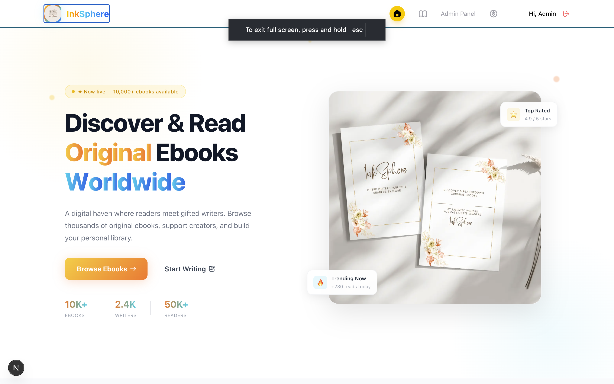
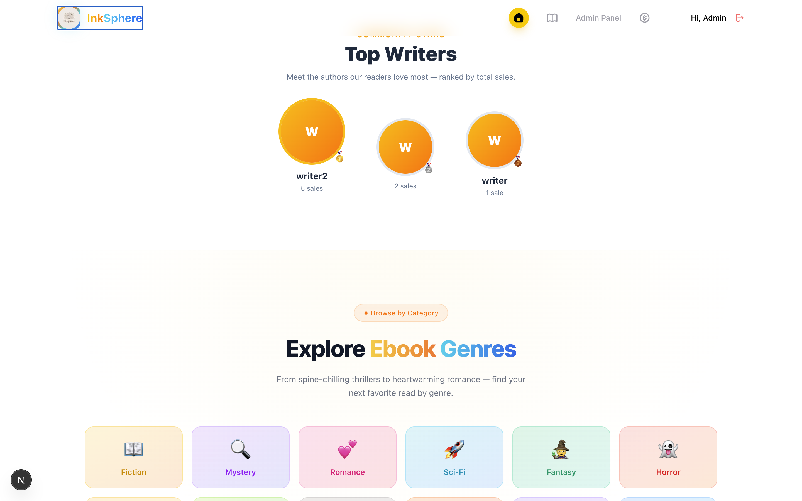
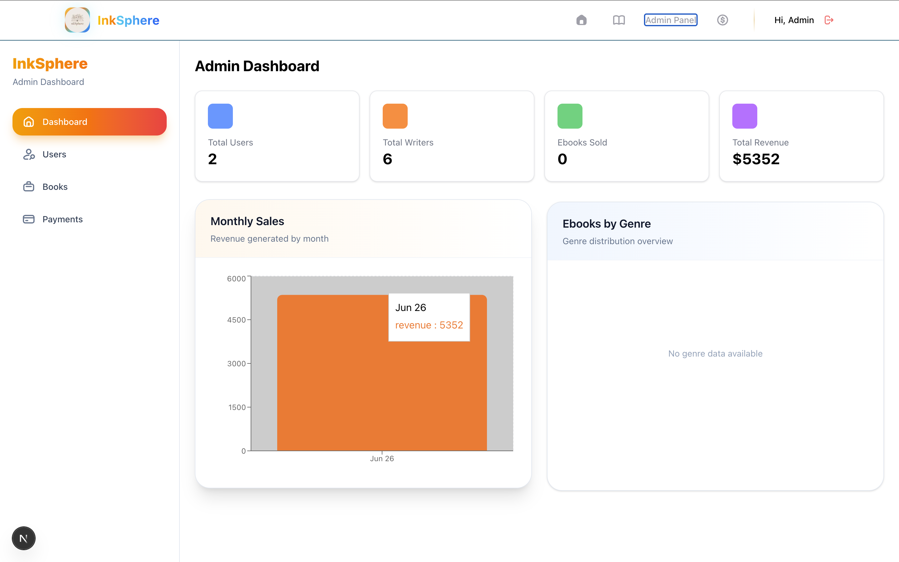

<div align="center">
  

  # InkSphere — Ebook Sharing Platform

  **A digital haven for ebook lovers and emerging writers.**  
  Discover, read, and share original stories from creators worldwide.

  [](https://your-live-url.vercel.app)
  [](https://github.com/your-username/inksphere-client)
  [](https://github.com/your-username/inksphere-server)

</div>

---

## 📸 Screenshots

### 🏠 Hero Section


### ✍️ Top Writers Section


### 🛡️ Admin Dashboard


---

## 📖 Project Overview

**InkSphere** is a full-stack ebook sharing platform built with the **MERN stack + Next.js**. It connects passionate readers with talented writers in a secure, streamlined digital environment. Writers can publish their original ebooks after a one-time verification, readers can purchase and read content seamlessly, and admins maintain full oversight of the ecosystem.

---

## ✨ Key Features

### 👤 For Readers
- Browse, search, filter, and sort all available ebooks
- Purchase ebooks securely via **Stripe Checkout**
- Bookmark ebooks for later reading
- View purchase history and purchased ebook gallery
- Track reading progress

### ✍️ For Writers
- Upload and manage original ebooks (with imgBB cover images)
- Publish / unpublish ebooks at any time
- View detailed sales history and revenue
- One-time verification payment to unlock publishing

### 🛡️ For Admin
- Manage all users — change roles (user / writer / admin), delete users
- Manage all ebooks — publish, unpublish, delete
- View all transactions (publishing fees + purchases)
- Analytics dashboard with charts: monthly sales, genre distribution

### 🌐 General
- Google OAuth + Email/Password authentication via **BetterAuth**
- JWT-based session management (7-day expiry)
- Role-based dashboards and private routes
- Fully responsive — mobile, tablet, desktop
- Skeleton loaders and meaningful error states
- Custom 404 page and error boundary UI
- Framer Motion animations throughout

---

## 🛠️ Technologies Used

### Frontend
| Technology | Purpose |
|---|---|
| **Next.js 15 (App Router)** | React framework with SSR/SSG |
| **React 19** | UI component library |
| **Tailwind CSS v4** | Utility-first styling |
| **HeroUI** | Pre-built accessible UI components |
| **Framer Motion** | Animations and transitions |
| **BetterAuth** | Google OAuth + JWT authentication |
| **Stripe.js** | Client-side payment integration |
| **Axios** | HTTP requests |
| **TanStack Query** | Server state management and caching |
| **React Hook Form** | Form handling and validation |
| **Recharts** | Analytics charts and graphs |
| **imgBB API** | Cover image upload and hosting |
| **next-themes** | Dark mode support |

### Backend
| Technology | Purpose |
|---|---|
| **Node.js** | Runtime environment |
| **Express.js** | REST API framework |
| **MongoDB** | NoSQL database |
| **Mongoose** | MongoDB ODM |
| **JWT (jsonwebtoken)** | Token-based authentication |
| **Stripe** | Payment processing |
| **CORS** | Cross-origin resource sharing |
| **dotenv** | Environment variable management |

---

## 📁 Project Structure

```
inksphere-client/
├── src/
│   ├── app/
│   │   ├── (root)/          # Public pages
│   │   ├── dashboard/       # Role-based dashboards
│   │   │   ├── user/
│   │   │   ├── writer/
│   │   │   └── admin/
│   │   ├── browse/          # Browse ebooks page
│   │   ├── ebook/[id]/      # Ebook details page
│   │   └── loading.jsx      # Global loading UI
│   ├── components/          # Reusable UI components
│   ├── lib/                 # Utilities, axios instance
│   └── hooks/               # Custom React hooks
├── public/
│   └── images/              # Static assets
└── .env.local               # Environment variables
```

---

## 🚀 Getting Started

### Prerequisites
- Node.js v18+
- MongoDB Atlas account
- Stripe account
- imgBB API key

### Installation

```bash
# Clone the client repository
git clone https://github.com/your-username/inksphere-client.git
cd inksphere-client

# Install dependencies
npm install

# Set up environment variables
cp .env.example .env.local
# Fill in your keys (see below)

# Run development server
npm run dev
```

### Environment Variables

```env
# .env.local

NEXT_PUBLIC_API_URL=http://localhost:5000

# BetterAuth
BETTER_AUTH_SECRET=your_secret
BETTER_AUTH_URL=http://localhost:3000
NEXT_PUBLIC_GOOGLE_CLIENT_ID=your_google_client_id

# Stripe
NEXT_PUBLIC_STRIPE_PUBLISHABLE_KEY=your_stripe_publishable_key

# imgBB
NEXT_PUBLIC_IMGBB_API_KEY=your_imgbb_api_key
```

```env
# Server .env

PORT=5000
MONGODB_URI=your_mongodb_connection_string
JWT_SECRET=your_jwt_secret
STRIPE_SECRET_KEY=your_stripe_secret_key
CLIENT_URL=http://localhost:3000
```

---

## 📦 npm Packages Used

### Client-side
```
next, react, react-dom, tailwindcss, @heroui/react,
framer-motion, better-auth, @stripe/stripe-js,
axios, @tanstack/react-query, react-hook-form,
recharts, next-themes, lucide-react
```

### Server-side
```
express, mongoose, jsonwebtoken, stripe,
cors, dotenv, bcryptjs, nodemailer
```

---

## 🔐 Admin Credentials

```
Email:    admin@fable.com
Password: Admin@123
```

---

## 📄 Pages Overview

| Route | Access | Description |
|---|---|---|
| `/` | Public | Home — hero, featured ebooks, top writers, genres |
| `/browse` | Public | Browse all ebooks with search, filter, sort, pagination |
| `/ebook/[id]` | Public | Ebook details, purchase button |
| `/dashboard/user` | User | Purchase history, bookmarks, profile |
| `/dashboard/writer` | Writer | Manage ebooks, add/edit, sales history, bookmarks |
| `/dashboard/admin` | Admin | Manage users, ebooks, transactions, analytics |
| `/login` | Guest | Email/password or Google login |
| `/register` | Guest | Registration with role selection |

---

## 🎯 Challenge Features Implemented

- ✅ **Search & Filtering** — by title, writer, genre, price range, availability
- ✅ **Sorting** — newest, price low-high, price high-low
- ✅ **Pagination** — 6–12 items per page with navigation controls
- ✅ **Wishlist / Bookmark System** — stored in database
- ✅ **Dark Mode** — using `next-themes`, persists in localStorage

---

## 🌐 Deployment

- **Client** — Deployed on [Vercel](https://vercel.com)
- **Server** — Deployed on [Railway](https://railway.app) / [Render](https://render.com)

---

<div align="center">
  <p>Made with ❤️ by <strong>Md Azizul Islam</strong></p>
  <p>© 2026 InkSphere. All rights reserved.</p>
</div>